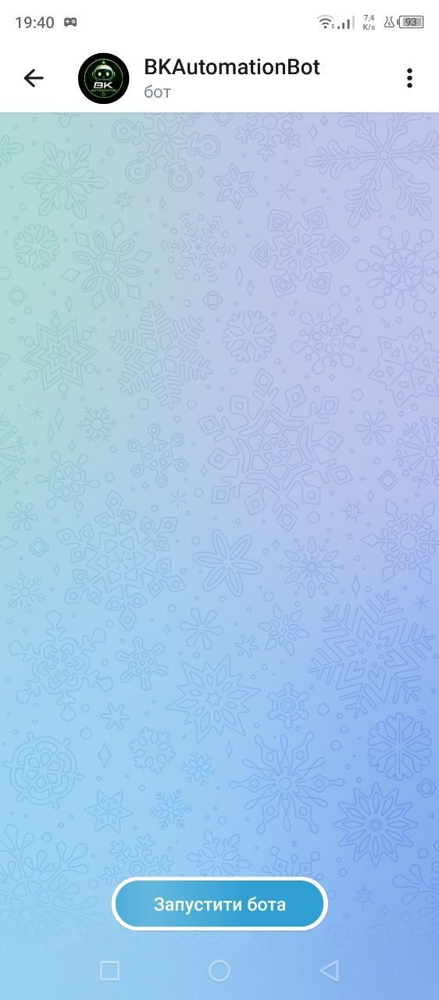
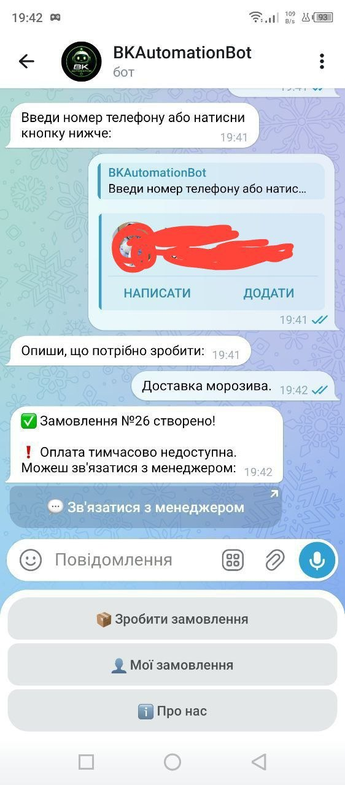
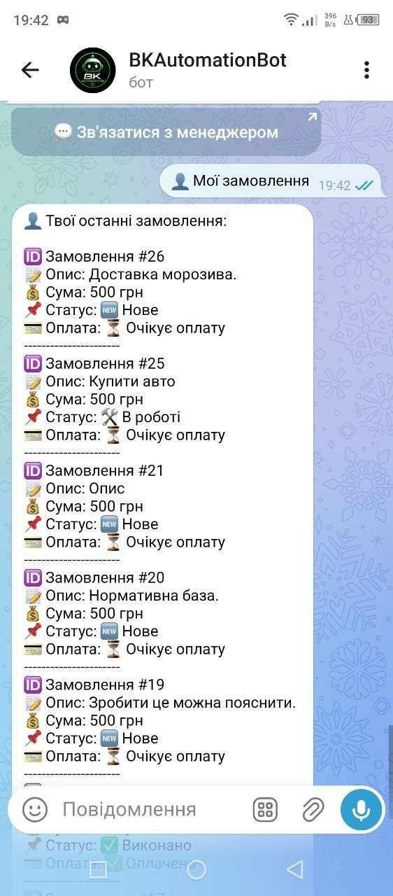
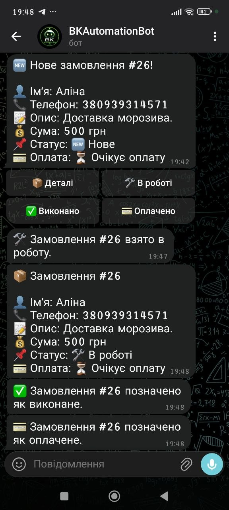
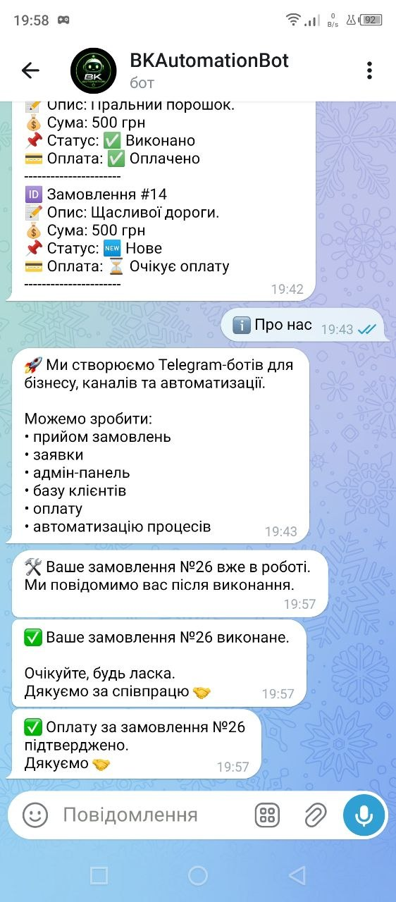

# 🚀 Telegram Order Bot (BK Automation)

> 🧠 Smart Telegram bot for handling orders, managing clients, and automating business processes.

---

## 📌 About the Project

**Telegram Order Bot** — це повноцінний бот для прийому замовлень з адмін-панеллю та системою статусів.

Проект демонструє реальний рівень розробки:

* робота з Telegram API (aiogram)
* FSM (форма замовлення)
* база даних (SQLite)
* адмін-логіка
* UX/UI через кнопки

---

## 🔥 Features

### 👤 Для клієнта:

* 📦 Створення замовлення
* 👤 Перегляд своїх замовлень
* 💬 Зв'язок з менеджером
* 💳 Кнопка оплати

---

### 👨‍💼 Для адміністратора:

* 📋 Перегляд замовлень (/admin)
* 🛠 Зміна статусу:

  * 🆕 Нове
  * 🛠 В роботі
  * ✅ Виконано
* 💳 Позначка оплати
* 📦 Деталі замовлення

---

## 📸 Screenshots

### 🏠 Start Menu



---

### 📦 Create Order



---

### 👤 My Orders



---

### 👨‍💼 Admin Panel



---

### 🔄 Order Status



---

## 🧠 Technologies

* Python 3
* Aiogram
* SQLite3
* Requests
* FSM (Finite State Machine)

---

## 📂 Project Structure

```
order-bot/
│
├── bot.py
├── database.py
├── keyboards.py
├── config.py
├── requirements.txt
├── screenshots/
└── README.md
```

---

## ⚙️ Installation

```
git clone https://github.com/bohdan-kohut/order-bot.git
cd order-bot

pip install -r requirements.txt
```

---

## 🔑 Environment Variables

Створи `.env`:

```
BOT_TOKEN=your_bot_token
ADMIN_ID=your_telegram_id
PAYMENT_AMOUNT_UAH=500
```

---

## ▶️ Run

```
python bot.py
```

---

## 💡 How it Works

1. Користувач створює замовлення
2. Адмін отримує заявку
3. Адмін змінює статус
4. Користувач отримує повідомлення

---

## 🧑‍💻 Author

**Bohdan Kohut**
Python Developer | Automation & Bots

* GitHub: https://github.com/bohdan-kohut
* Telegram: https://t.me/bogdan4446

---

## 🚀 Future Improvements

* 💳 Повна інтеграція оплати
* 📊 Аналітика
* 🧾 Історія платежів
* 🌐 Web-панель

---

## 💼 Available for Freelance

Я розробляю Telegram-ботів для:

* бізнесу
* автоматизації
* CRM систем
* прийому замовлень

📩 Пиши: https://t.me/bogdan4446
